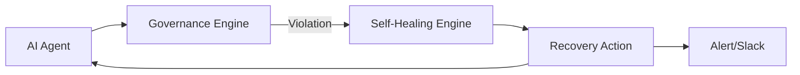

# Tutorial 3: Self-Healing

ARGUS automatically detects and recovers from common AI agent failures.

## How It Works



## Detection Plugins

ARGUS monitors for these failure modes:

| Plugin | Detects |
|--------|---------|
| InfiniteLoop | Agent repeating the same action |
| TokenExplosion | Rapid token consumption |
| AgentStuck | No progress for extended period |
| BudgetExceeded | Cost limit exceeded |
| RetryStorm | Excessive retry attempts |
| ToolTimeout | Tool calls exceeding time limit |
| LatencySpike | Sudden latency increase |
| RepeatedPrompt | Identical prompt submissions |
| PromptRecursion | Prompt self-referencing |

## Recovery Actions

When a violation is detected, ARGUS can:

| Action | Effect |
|--------|--------|
| KillAgent | Terminates the agent immediately |
| Retry | Retries with backoff |
| FallbackModel | Switches to cheaper/safer model |
| ReduceContext | Trims conversation context |
| SwitchPrompt | Replaces system prompt |
| CircuitBreaker | Temporarily blocks the agent |
| DisableTool | Removes problematic tool access |
| EscalateHuman | Notifies a human operator |

## Example: Simulate a Violation

Run the demo agent in violation mode:

```bash
cd demo
python agent.py --mode violation
```

This will intentionally trigger a budget violation, and the dashboard will show the self-healing action taken.
